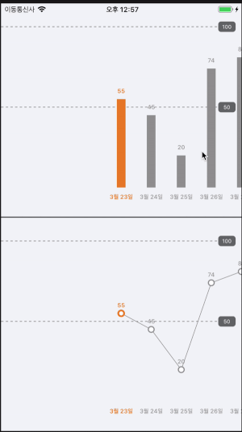
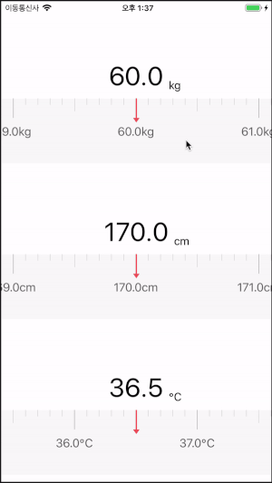
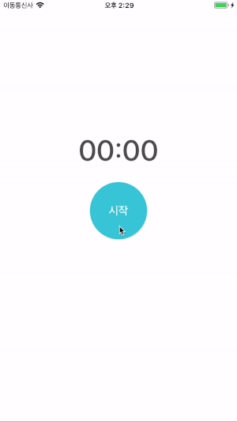
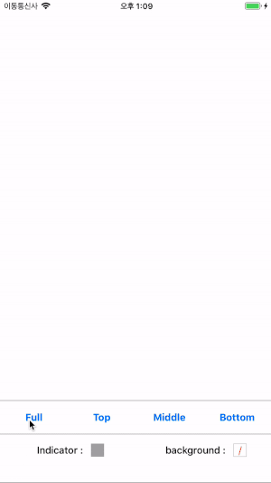

CustomView
===============

## 1. CustomView를 정리하는 이유
이미 애플에서는 기본적으로 많은 컨트롤들을 지원해주어 앱 개발을 할 때 큰 불편함 없이 개발을 할 수 있도록 도와줍니다.

하지만 누구나 자신이 만든 앱은 다른 앱과는 다른 자신만이 가지고 있는 기능이나 UI를 원하는데 애플에서 제공하는 기본 컨트롤만으로는 자신의 색깔을 나타내기엔 많이 부족합니다.

그래서 대부분의 앱들은 자신만의 색깔을 나타내기 위해 커스텀 뷰나 애니메이션 그리고 다른 여러가지를 조합해 자신만의 색깔을 나타내는데, 생각보다 커스텀 뷰를 만드는 시간과 노력이 많이 들어가 많은 개발자들은 커스텀 뷰를 만드는 것에 어려움을 느끼고 힘들어 하고 있습니다.

이러한 이유로 부족하지만 제가 만든 커스텀 뷰를 정리하여 공유하므로 많은 개발자들이 참고하여 좀 더 수월하게 커스텀 뷰를 만들고, 저 또한 계속해서 더 좋은 커스텀 뷰를 만들기 위해 지금까지 만든 커스텀 뷰를 정리합니다.

## 2. CustomView 종류
* **ChartView**

  스크롤 뷰와 Layer를 이용하여 만든 ChartView입니다. 현재 ChartView는 막대차트와 선형차트를 지원합니다.
  
```swift
//막대 차트 : Default
chartView.chartType = .Bar

//선형 차트
chartView.chartType = .Line
```
  

* **TapeMeasureView**

  스크롤 뷰와 Layer를 이용하여 만든 TapeMeasureView입니다. 줄자를 표현한 커스텀 뷰로 수치를 입력할 때 사용됩니다.
  
```swift
// 줄자의 최소 값
tapeMeasureView.minData = 10.0

// 줄자의 최대 값
tapeMeasureView.maxData = 250.0

// 줄자가 시작할 위치의 값
tapeMeasureView.startData = 60.0

// 줄자에 표시 될 단위
tapeMeasureView.unit = "kg"

// 줄자 세팅
tapeMeasureView.setTapeMeasure()
```
  

* **StopWatchLabel**

  라벨과 타이머를 이용하여 만든 StopWathchLabel입니다. 인증번호 입력이나, 세션 유효 시간 등의 시간을 나타낼 때 사용됩니다.
  
```swift 
  // 스탑워치를 시작합니다.
  // counter : 스탑워치의 총 시간
  stopWatchLabel.startStopWatch(counter: 10.0)
  
  // 스탑워치를 종료합니다.
  stopWatchLabel.stopStopWatch()
  
  // 스탑워치 시간이 0이 되었을 때 이벤트를 받기 위한 Delegate
  stopWatchLabel.delegate = self
```
  
  
* **LoadingActivityIndicator**

  UIActivityIndicatorView를 편하게 사용하기 위해 만든 커스텀 UIActivityIndicatorView입니다.
  
```swift 
  // UIActivityIndicatorView를 시작합니다.
  // targetView : UIActivityIndicatorView를 실행 할 타겟 뷰입니다.
  // indicatorColor : UIActivityIndicatorView의 색상입니다.
  // overlayViewColor : targetView 위에 씌어질 overlayView의 배경색입니다.
  LoadingActivityIndicator.shared.start(targetView, indicatorColor: indicatorColor, overlayViewColor: overlayViewColor)
  
  // UIActivityIndicatorView를 종료합니다.
  // targetView : UIActivityIndicatorView를 종료 할 타겟 뷰입니다.
  LoadingActivityIndicator.shared.stop(targetView)
```
  
